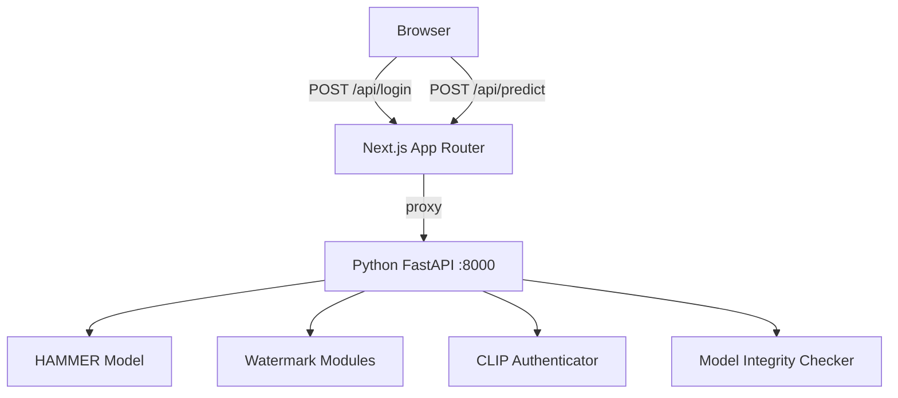
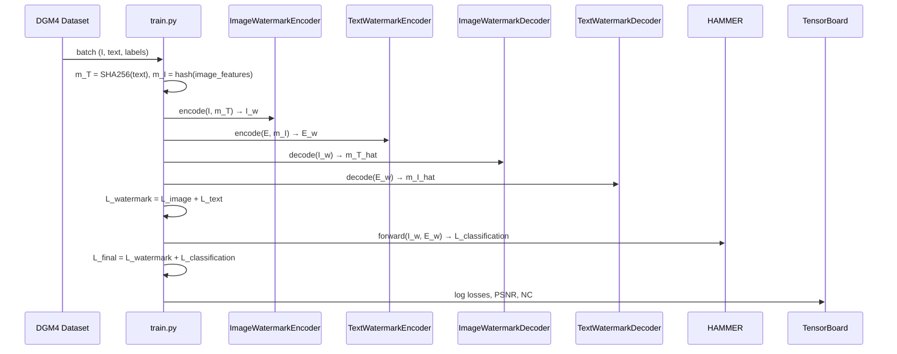
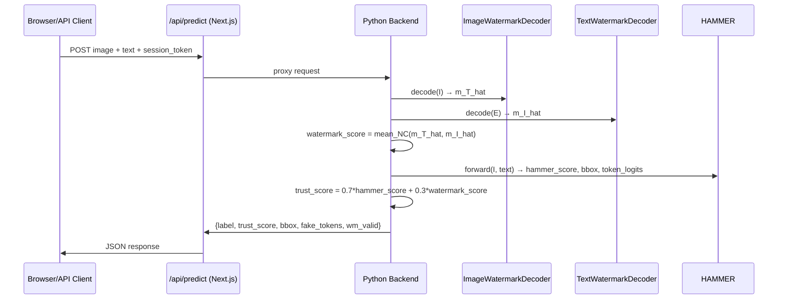

# Design Document: Secure Deepfake Detection System

## Overview

This document describes the technical design for transforming the existing DGM4 + HAMMER multimodal
deepfake detection repository into a production-ready, secure system. The enhanced system adds:

- Cross-modal neural watermarking (image CNN encoder/decoder + text projection encoder/decoder)
- CLIP-based access control (image + password authentication)
- Model integrity verification via SHA-256
- A unified Next.js application hosting both the React frontend and the Python-backed API routes
- A consolidated metrics module (PSNR, NC, AUC, EER, ACC, IoU, token F1/P/R, mAP)
- An integrated training pipeline (FP16, frozen encoders, joint loss)
- An integrated inference pipeline (trust score = 0.7 × hammer + 0.3 × watermark)

The design preserves all existing HAMMER detection and grounding capabilities while adding the new
security and watermarking layers on top.

---

## Architecture

The system is split into two runtime processes that communicate over HTTP:

1. **Python ML Backend** — a FastAPI server (spawned by Next.js at startup or run separately)
   that hosts HAMMER, the watermark modules, and the CLIP authenticator.
2. **Next.js Application** — serves the React frontend and exposes `/api/login` and `/api/predict`
   as Next.js Route Handlers that proxy to the Python backend.

> **Design decision**: The requirements mandate "no separate backend server process" visible to the
> end user (Req 14.7, 15.8). We satisfy this by having Next.js own the public API surface and
> manage the Python process lifecycle. The Python process is an implementation detail, not a
> separately deployed service.



### High-Level Data Flow — Training



### High-Level Data Flow — Inference



---

## Components and Interfaces

### Directory Structure

```
.
├── models/
│   ├── HAMMER.py                    # existing — unchanged
│   ├── vit.py                       # existing — unchanged
│   ├── xbert.py                     # existing — unchanged
│   ├── box_ops.py                   # existing — unchanged
│   ├── watermark_image_encoder.py   # NEW
│   ├── watermark_image_decoder.py   # NEW
│   ├── watermark_text_encoder.py    # NEW
│   └── watermark_text_decoder.py    # NEW
├── auth/
│   ├── clip_auth.py                 # NEW
│   └── user_db.py                   # NEW
├── utils/
│   └── metrics.py                   # NEW (replaces scattered metric code)
├── integrity/
│   └── model_integrity.py           # NEW
├── backend/
│   └── server.py                    # NEW — FastAPI server
├── train.py                         # MODIFIED — joint watermark + HAMMER training
├── test.py                          # MODIFIED — trust score inference
├── configs/
│   ├── train.yaml                   # MODIFIED — watermark + subset config
│   └── test.yaml                    # existing
├── web/                             # NEW — Next.js application
│   ├── app/
│   │   ├── page.tsx                 # login page
│   │   ├── detect/
│   │   │   └── page.tsx             # detection page
│   │   └── api/
│   │       ├── login/
│   │       │   └── route.ts         # POST /api/login
│   │       └── predict/
│   │           └── route.ts         # POST /api/predict
│   ├── components/
│   │   ├── LoginForm.tsx
│   │   ├── DetectionForm.tsx
│   │   └── ResultVisualization.tsx
│   └── package.json
└── requirements.txt                 # MODIFIED — add clip, fastapi, etc.
```

### Image Watermark Encoder (`models/watermark_image_encoder.py`)

UNet-style CNN that embeds a 128-bit watermark into an image via residual addition.

```python
class ImageWatermarkEncoder(nn.Module):
    def __init__(self, alpha: float = 0.03):
        """
        alpha: perturbation scale, clamped to [0.01, 0.05]
        Architecture: ResNet-18 encoder + UNet skip-connection decoder
        Watermark m_T (128-bit) is tiled and concatenated to bottleneck features
        """

    def forward(self, image: Tensor, m_T: Tensor) -> Tensor:
        """
        Args:
            image: (B, 3, 224, 224) normalized image tensor
            m_T:   (B, 128) binary watermark vector (float32 0/1)
        Returns:
            I_w:   (B, 3, 224, 224) watermarked image, same shape as input
        Formula: I_w = image + alpha * f_theta(image, m_T)
        """
```

**Architecture detail**: The encoder uses a ResNet-18 backbone (pretrained=False, lightweight) as
the encoder path. The 128-bit watermark is projected to a spatial feature map via a linear layer
and concatenated at the bottleneck. A 4-layer transposed-conv decoder with skip connections
produces the residual perturbation. `alpha` is a learnable scalar initialized to 0.03 and clamped
to [0.01, 0.05] via `torch.clamp` in `forward`.

### Image Watermark Decoder (`models/watermark_image_decoder.py`)

Lightweight CNN that extracts the 128-bit watermark from a (possibly degraded) watermarked image.

```python
class ImageWatermarkDecoder(nn.Module):
    def __init__(self):
        """
        Architecture: 4-layer strided conv → GlobalAvgPool → Linear(512, 128) → Sigmoid
        """

    def forward(self, image_w: Tensor) -> Tensor:
        """
        Args:
            image_w: (B, 3, 224, 224) watermarked image tensor
        Returns:
            m_T_hat: (B, 128) predicted watermark, values in [0, 1]
        """
```

### Text Watermark Encoder (`models/watermark_text_encoder.py`)

Projection-layer encoder that adds a watermark perturbation to BERT token embeddings.

```python
class TextWatermarkEncoder(nn.Module):
    def __init__(self, hidden_dim: int = 768, watermark_dim: int = 128, alpha: float = 0.03):
        """
        P: Linear(watermark_dim, hidden_dim) — learned projection
        alpha: clamped to [0.01, 0.05]
        """

    def forward(self, embeddings: Tensor, m_I: Tensor) -> Tensor:
        """
        Args:
            embeddings: (B, seq_len, hidden_dim) BERT token embeddings
            m_I:        (B, 128) watermark vector derived from image features
        Returns:
            E_w: (B, seq_len, hidden_dim) watermarked embeddings
        Formula: E_w = embeddings + alpha * P(m_I).unsqueeze(1).expand_as(embeddings)
        """
```

### Text Watermark Decoder (`models/watermark_text_decoder.py`)

Extracts the 128-bit watermark from watermarked token embeddings via mean pooling + MLP.

```python
class TextWatermarkDecoder(nn.Module):
    def __init__(self, hidden_dim: int = 768, watermark_dim: int = 128):
        """
        Architecture: MeanPool(seq_len) → Linear(hidden_dim, 256) → GELU → Linear(256, 128) → Sigmoid
        """

    def forward(self, embeddings_w: Tensor) -> Tensor:
        """
        Args:
            embeddings_w: (B, seq_len, hidden_dim) watermarked token embeddings
        Returns:
            m_I_hat: (B, 128) predicted watermark, values in [0, 1]
        """
```

### CLIP Authenticator (`auth/clip_auth.py`)

```python
class CLIPAuthenticator:
    def __init__(self, model_name: str = "openai/clip-vit-base-patch32", threshold: float = 0.85):
        """
        Loads frozen CLIP model. Weights are never updated.
        """

    def compute_embedding(self, image: PIL.Image, password: str) -> np.ndarray:
        """
        Returns: unit-normalized float32 vector of shape (512,)
        Formula: normalize(CLIP_image(image) + CLIP_text(password))
        """

    def register(self, username: str, image: PIL.Image, password: str) -> None:
        """Raises ConflictError if username already exists."""

    def authenticate(self, username: str, image: PIL.Image, password: str) -> str:
        """
        Returns: session_token (JWT) if cosine_similarity > threshold
        Raises: AuthenticationError if similarity <= threshold
        """
```

### User DB (`auth/user_db.py`)

```python
class UserDB:
    def __init__(self, db_path: str = "auth/users.npz"):
        """
        Loads from db_path on init. If missing/corrupted, initializes empty store and logs warning.
        Storage format: numpy .npz with arrays 'usernames' (str) and 'embeddings' (float32, N×512)
        """

    def save(self, username: str, embedding: np.ndarray) -> None:
        """Raises ConflictError if username exists."""

    def lookup(self, username: str) -> np.ndarray:
        """Returns embedding or raises KeyError."""

    def persist(self) -> None:
        """Writes current state to db_path atomically."""
```

### Model Integrity (`integrity/model_integrity.py`)

```python
class ModelIntegrityError(Exception): ...

def compute_file_hash(path: str) -> str:
    """Returns hex SHA-256 digest of file at path."""

def save_hashes(model_paths: dict[str, str], hash_file: str = "model_hashes.json") -> None:
    """Computes and saves SHA-256 hashes for all model weight files."""

def verify_model(path: str, expected_hash: str) -> None:
    """
    Recomputes SHA-256 of file at path.
    Raises ModelIntegrityError if hash does not match expected_hash.
    """
```

### Metrics Module (`utils/metrics.py`)

```python
def compute_psnr(original: Tensor, watermarked: Tensor) -> float:
    """PSNR = 10 * log10(1.0 / MSE). Returns float('inf') when MSE=0. Raises ValueError on shape mismatch."""

def compute_nc(m: Tensor, m_hat: Tensor) -> float:
    """NC = dot(m, m_hat) / (||m|| * ||m_hat||). Returns float in [-1, 1]. Raises ValueError on shape mismatch."""

def compute_auc(y_true: np.ndarray, y_score: np.ndarray) -> float: ...
def compute_eer(y_true: np.ndarray, y_score: np.ndarray) -> float: ...
def compute_acc(y_true: np.ndarray, y_pred: np.ndarray) -> float: ...
def compute_iou_mean(iou_scores: list[float]) -> float: ...
def compute_iou_at_50(iou_scores: list[float]) -> float: ...
def compute_iou_at_75(iou_scores: list[float]) -> float: ...
def compute_iou_at_95(iou_scores: list[float]) -> float: ...
def compute_token_f1(tp: int, fp: int, fn: int) -> float: ...
def compute_token_precision(tp: int, fp: int) -> float: ...
def compute_token_recall(tp: int, fn: int) -> float: ...
def compute_map(ap_meter: AveragePrecisionMeter) -> float: ...
```

### Python FastAPI Backend (`backend/server.py`)

```python
# POST /auth/login  — called by Next.js /api/login
# POST /detect      — called by Next.js /api/predict
# Startup: loads all models, verifies integrity hashes, initializes UserDB
```

### Next.js API Routes

**`web/app/api/login/route.ts`**
```typescript
export async function POST(request: Request): Promise<Response>
// Accepts: multipart/form-data { image: File, password: string }
// Returns: { token: string } | HTTP 401
// Proxies to Python backend /auth/login
```

**`web/app/api/predict/route.ts`**
```typescript
export async function POST(request: Request): Promise<Response>
// Accepts: multipart/form-data { image: File, text: string }
// Requires: Authorization: Bearer <token> header
// Returns: DetectionResult | HTTP 401 | HTTP 422
// Proxies to Python backend /detect
```

---

## Data Models

### Watermark Vector

```python
# 128-bit binary vector derived from SHA-256
# m_T = SHA256(text_bytes)[:16]  → 16 bytes → 128 bits as float32 tensor
# m_I = SHA256(image_feature_bytes)[:16] → same
# Shape: (B, 128), dtype: float32, values: {0.0, 1.0}
```

### Detection Result (Python)

```python
@dataclass
class DetectionResult:
    label: Literal["real", "fake"]
    trust_score: float          # 0.7 * hammer_score + 0.3 * watermark_score
    hammer_score: float         # P(fake) from HAMMER BIC head
    watermark_score: float      # mean NC of extracted watermarks
    watermark_valid: bool       # watermark_score >= 0.5
    bbox: list[float]           # [cx, cy, w, h] normalized, or None
    fake_token_positions: list[int]  # token indices predicted as fake
```

### Detection Result (TypeScript / API response)

```typescript
interface DetectionResult {
  label: "real" | "fake";
  trust_score: number;
  hammer_score: number;
  watermark_score: number;
  watermark_valid: boolean;
  bbox: [number, number, number, number] | null;  // [cx, cy, w, h] normalized
  fake_token_positions: number[];
}
```

### User Record (UserDB)

```python
# Stored in .npz:
# usernames: np.array of str, shape (N,)
# embeddings: np.array of float32, shape (N, 512)
# No raw images, no raw passwords, no reversible representations
```

### Training Config Extension (`configs/train.yaml` additions)

```yaml
# Watermark training additions
watermark_alpha: 0.03
watermark_dim: 128
subset_size: 35000          # 30K–40K balanced subset
image_res: 224              # override from 256 to 224
use_fp16: true
freeze_encoders: true
epochs: 8                   # override from 50
batch_size_train: 32
loss_watermark_wgt: 1.0
```

---

## Correctness Properties

*A property is a characteristic or behavior that should hold true across all valid executions of a
system — essentially, a formal statement about what the system should do. Properties serve as the
bridge between human-readable specifications and machine-verifiable correctness guarantees.*

### Property 1: Image encoder output shape preservation

*For any* batch of images of shape `(B, 3, 224, 224)` and any 128-bit watermark vectors of shape
`(B, 128)`, the `ImageWatermarkEncoder` SHALL produce an output tensor of exactly shape
`(B, 3, 224, 224)`.

**Validates: Requirements 2.2, 2.3**

---

### Property 2: Text encoder output shape preservation

*For any* token embedding tensor of shape `(B, seq_len, hidden_dim)` and any watermark vector of
shape `(B, 128)`, the `TextWatermarkEncoder` SHALL produce an output tensor of exactly shape
`(B, seq_len, hidden_dim)`.

**Validates: Requirements 4.2, 4.3**

---

### Property 3: Image watermark round-trip NC

*For any* valid image tensor `I` of shape `(B, 3, 224, 224)` and any 128-bit watermark vector
`m_T`, applying `ImageWatermarkEncoder` followed by `ImageWatermarkDecoder` SHALL produce `m_T_hat`
such that `NC(m_T, m_T_hat) > 0.95` (measured on a trained model).

**Validates: Requirements 3.2, 16.1**

---

### Property 4: Text watermark round-trip NC

*For any* valid token embedding tensor `E` of shape `(B, seq_len, hidden_dim)` and any 128-bit
watermark vector `m_I`, applying `TextWatermarkEncoder` followed by `TextWatermarkDecoder` SHALL
produce `m_I_hat` such that `NC(m_I, m_I_hat) > 0.95` (measured on a trained model).

**Validates: Requirements 5.2, 16.2**

---

### Property 5: PSNR identity and correctness

*For any* tensor `T` of any shape, `compute_psnr(T, T)` SHALL return `float('inf')` or a value
exceeding 100 dB. *For any* two tensors of the same shape with known MSE, `compute_psnr` SHALL
return the value matching `10 * log10(1.0 / MSE)`.

**Validates: Requirements 8.1, 8.4, 16.3**

---

### Property 6: NC identity, range, and correctness

*For any* tensor `T` of any shape, `compute_nc(T, T)` SHALL return exactly `1.0`. *For any* two
tensors of the same shape, `compute_nc` SHALL return a value in `[-1.0, 1.0]`. *For any* tensor
`T`, `compute_nc(T, -T)` SHALL return `-1.0`.

**Validates: Requirements 8.2, 8.5, 16.4**

---

### Property 7: Metrics ValueError on shape mismatch

*For any* two tensors with different shapes, both `compute_psnr` and `compute_nc` SHALL raise a
`ValueError` with a descriptive message.

**Validates: Requirements 8.6**

---

### Property 8: Trust score formula correctness

*For any* `hammer_score` in `[0.0, 1.0]` and `watermark_score` in `[0.0, 1.0]`, the computed
`trust_score` SHALL equal exactly `0.7 * hammer_score + 0.3 * watermark_score`.

**Validates: Requirements 10.4**

---

### Property 9: Watermark score defaults to 0.0 on invalid input

*For any* invalid or missing watermark input (None, wrong shape, NaN values), the inference
pipeline SHALL set `watermark_score = 0.0` and SHALL NOT raise an unhandled exception.

**Validates: Requirements 10.6**

---

### Property 10: Consistency flag threshold

*For any* `watermark_score` strictly below `0.5`, the inference pipeline SHALL set
`watermark_valid = False`. *For any* `watermark_score` at or above `0.5`, the inference pipeline
SHALL set `watermark_valid = True`.

**Validates: Requirements 6.3**

---

### Property 11: User embedding is unit-normalized

*For any* profile image and password string, `CLIPAuthenticator.compute_embedding` SHALL return a
vector `e` such that `||e||_2 = 1.0` (within floating-point tolerance of 1e-5).

**Validates: Requirements 11.2**

---

### Property 12: Authentication threshold decision

*For any* query embedding and stored embedding, `CLIPAuthenticator.authenticate` SHALL grant access
if and only if `cosine_similarity(query, stored) > threshold`. Access SHALL be denied for any pair
with similarity at or below the threshold.

**Validates: Requirements 11.4, 11.5**

---

### Property 13: Username conflict detection

*For any* username that has already been registered in `UserDB`, attempting to register the same
username again SHALL raise a `ConflictError` and SHALL NOT overwrite the existing record.

**Validates: Requirements 12.4**

---

### Property 14: Model integrity hash verification

*For any* model weight file, if even a single byte is modified after the hash is saved, calling
`verify_model` SHALL raise `ModelIntegrityError`. If the file is unmodified, `verify_model` SHALL
complete without raising.

**Validates: Requirements 13.2, 13.3**

---

### Property 15: Balanced sampler equal class counts

*For any* dataset with `N` real and `M` fake samples, the balanced sampler SHALL return a subset of
size `2 * min(N, M)` with exactly equal numbers of real and fake samples.

**Validates: Requirements 1.1**

---

### Property 16: Encoder freeze preserves trainability of other parameters

*For any* HAMMER model instance, after calling `freeze_encoders()`, all parameters in
`visual_encoder` and `text_encoder` SHALL have `requires_grad = False`, and all parameters in the
fusion layers, classification head, and watermark modules SHALL have `requires_grad = True`.

**Validates: Requirements 1.4, 1.5**

---

## Error Handling

### Model Loading Errors

- `ModelIntegrityError` is raised before any model weights are applied to memory.
- The server startup sequence verifies all five model components before accepting requests.
- If any hash fails, the server logs the failure and exits with a non-zero code.

### Watermark Errors

- If `ImageWatermarkDecoder` or `TextWatermarkDecoder` receives an input of unexpected shape, it
  raises `ValueError` before any computation.
- The inference pipeline wraps watermark extraction in a try/except; on any exception,
  `watermark_score = 0.0` and `watermark_valid = False` are set.

### Authentication Errors

- `AuthenticationError` is raised (not propagated as HTTP 500) when similarity ≤ threshold.
- The API route catches `AuthenticationError` and returns HTTP 401 without internal details.
- `ConflictError` is raised on duplicate registration; the API returns HTTP 409.

### UserDB Corruption

- On startup, if the `.npz` file is missing or raises any exception during load, `UserDB`
  initializes an empty in-memory store and logs a `WARNING` with the exception message.
- The server continues to operate; new registrations will create a fresh DB file.

### API Input Validation

- `/api/predict` validates that the uploaded file is a valid image (PIL.Image.open succeeds) before
  forwarding to the Python backend. Invalid files return HTTP 422.
- Session tokens are validated as JWTs with a configurable secret and expiry. Missing or expired
  tokens return HTTP 401.

### FP16 Overflow

- `GradScaler` handles FP16 overflow by skipping the optimizer step and scaling down. The training
  loop logs a warning when a step is skipped.

---

## Testing Strategy

### Dual Testing Approach

Unit tests cover specific examples, edge cases, and error conditions. Property-based tests verify
universal properties across many generated inputs. Both are needed for comprehensive coverage.

### Property-Based Testing Library

**Python**: `hypothesis` (https://hypothesis.readthedocs.io/)
- Minimum 100 iterations per property test (Hypothesis default `max_examples=100`)
- Each test is tagged with a comment referencing the design property

**TypeScript**: `fast-check` (https://fast-check.dev/)
- Used for frontend/API route logic tests

### Property Test Configuration

```python
# Example property test structure
from hypothesis import given, settings
from hypothesis import strategies as st

@settings(max_examples=100)
@given(
    batch_size=st.integers(min_value=1, max_value=8),
    # ... other generators
)
def test_property_1_image_encoder_shape(batch_size, ...):
    # Feature: secure-deepfake-detection, Property 1: image encoder output shape preservation
    ...
```

### Unit Tests

Focus on:
- Specific examples for loss function computation (L_image, L_text, L_final)
- Integration points: HAMMER forward pass with watermarked inputs
- Edge cases: empty text, single-pixel images, zero-length sequences
- API route behavior: 401 on missing token, 422 on bad image, 409 on duplicate username

### Integration Tests

- Full training loop for 1 epoch on a 100-sample subset (smoke test)
- Full inference pipeline end-to-end with a known image-text pair
- Next.js API routes with a running Python backend (1-3 representative examples)
- UserDB persistence: write, restart, read back

### Test File Layout

```
tests/
├── test_metrics.py              # Properties 5, 6, 7
├── test_watermark_encoder.py    # Properties 1, 2
├── test_watermark_decoder.py    # Properties 3, 4
├── test_trust_score.py          # Properties 8, 9, 10
├── test_clip_auth.py            # Properties 11, 12
├── test_user_db.py              # Property 13
├── test_model_integrity.py      # Property 14
├── test_balanced_sampler.py     # Property 15
├── test_freeze_encoders.py      # Property 16
└── integration/
    ├── test_training_loop.py
    ├── test_inference_pipeline.py
    └── test_api_routes.py
```

### Performance Targets

- Inference latency: < 10 seconds per image-text pair on T4 GPU (Req 14.6)
- Training time: 6–8 hours for 6–8 epochs on 30K–40K samples on T4 GPU (Req 1.7)
- PSNR target: > 40 dB (Req 2.5, 7.4)
- NC target: > 0.95 (Req 3.2, 5.2, 7.4)
